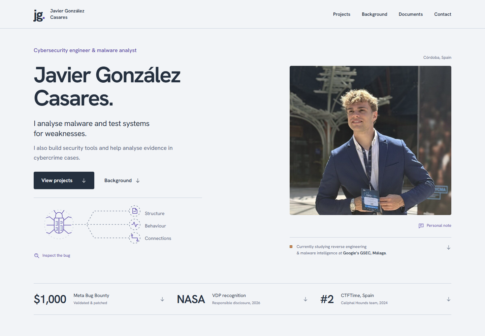

# Javier González Casares · Portfolio

Portfolio de ciberseguridad y análisis de malware, construido con HTML, CSS y JavaScript estáticos.



La web reúne cuatro proyectos destacados y otros 17 con búsqueda y filtros, 25 entradas de trayectoria y cinco PDF. BrillanteSeguro tiene una sola ficha para su repositorio y su web. El máster figura como terminado y el diploma de ingeniería inversa e inteligencia de malware como en curso, según lo confirmado por Javier.

El contenido público está en inglés. [COPY-AUDIT.md](COPY-AUDIT.md) explica la revisión del texto; [DESIGN.md](DESIGN.md), los criterios visuales; y [VALIDATION.md](VALIDATION.md), las comprobaciones.

## Ejecutar en local

No requiere instalación ni compilación. Desde esta carpeta:

```sh
python -m http.server 4173
```

Abre `http://localhost:4173/`. Un servidor local permite probar el portapapeles y los símbolos SVG en el contexto normal del navegador.

## Publicación y edición

Se mantiene la estructura de GitHub Pages: `index.html` y rutas relativas a `assets/`. La web pública cambia cuando se integra la propuesta en la rama de publicación.

- Contenido: `index.html`.
- Tipografía, colores y estructura: `assets/css/styles.css`.
- Ilustraciones y ajustes de proyectos: `assets/css/personality.css`.
- Menú, filtros, pestañas, enlaces directos y copia del correo: `assets/js/main.js`.
- Ilustración interactiva del insecto: `assets/js/personality.js`.
- Símbolos de proyectos y acciones: `assets/img/analysis-symbols.svg`.

El orden está en el HTML y se conserva sin JavaScript. Las categorías usan `data-category`; los parámetros `category` y `q` conservan el filtro y la búsqueda. El antiguo enlace `#project-13` abre la ficha unificada de BrillanteSeguro.

La identidad visual parte de una mesa de análisis: diagramas de relaciones, símbolos de línea y un insecto que se desmonta al inspeccionar la ilustración. Nombre completo, logo, fechas, cifras y texto usan Hanken Grotesk. El índice de proyectos abre una ficha a la vez; la trayectoria combina tres hitos de formación con pestañas de experiencia, formación, premios y comunidad. Sin JavaScript se muestran todos los grupos.

El contacto ofrece el correo directamente mediante `mailto:` y un botón para copiarlo. El formulario y su código de envío se han eliminado. Se conservan los enlaces a GitHub, LinkedIn y teléfono.

Hanken Grotesk se aloja localmente con licencia SIL Open Font License, incluida en `assets/fonts/`. La fuente pixel se ha retirado por legibilidad y coherencia del nombre. Los PDF y las imágenes originales no se han editado. [ICON-AUDIT.md](ICON-AUDIT.md) documenta los símbolos y sus funciones.
